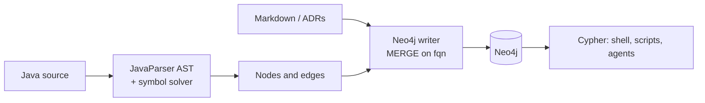
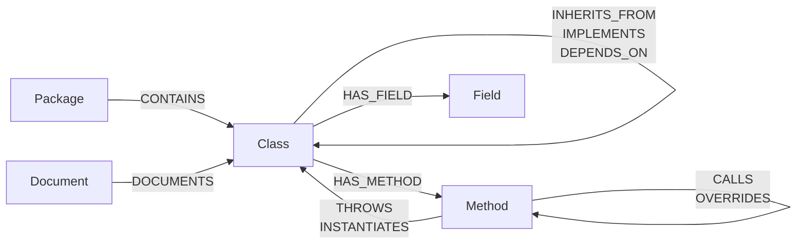

<p align="center">
  <picture>
    <source media="(prefers-color-scheme: dark)" srcset="docs/images/logo-dark.svg">
    
  </picture>
</p>

<p align="center">
  <b>A knowledge graph for Java codebases.</b><br>
  Parse Java source into a Neo4j property graph — packages, classes, methods, fields and how they<br>
  relate — and put your Markdown docs and ADRs right next to the code they describe.
</p>

<p align="center">
  <a href="LICENSE"></a>
  
  
  
  
</p>

<p align="center">
  <a href="#quickstart">Quickstart</a> ·
  <a href="#how-it-works">How it works</a> ·
  <a href="#graph-schema">Graph schema</a> ·
  <a href="#commands">Commands</a> ·
  <a href="#example-queries">Example queries</a>
</p>

```console
$ lumesh-graph query "MATCH (m:Method)-[:OVERRIDES]->(base:Method) RETURN m.fqn, base.fqn"
{m.fqn=dev.lumesh.graph.parser.InMemoryGraphSink#writeNode(GraphNode), base.fqn=dev.lumesh.graph.parser.GraphSink#writeNode(GraphNode)}
{m.fqn=dev.lumesh.graph.parser.InMemoryGraphSink#writeEdge(String,String,String), base.fqn=dev.lumesh.graph.parser.GraphSink#writeEdge(String,String,String)}
```

<p align="center"><sub>lumesh-graph, run on its own source code.</sub></p>

## Why

Coding agents and new team members ask the same questions about a codebase: *Who implements
this interface? Where is this exception thrown? Which classes are Spring services? Is there an
ADR for this?* Answering them with `grep` means reading files one by one and guessing at the
structure in between.

lumesh-graph builds that structure once, up front, with a real Java parser. The result is a
graph you can query with Cypher — from the shell, from a script, or as a tool an agent calls.
Building the graph needs no LLM: it is plain static analysis, so it is fast, free and gives
the same answer every time.

## Features

- **Structure, not text.** Packages, classes, interfaces, enums, methods, constructors and
  fields become nodes; containment, inheritance, overrides, thrown exceptions and
  instantiations become edges.
- **Rich metadata on every node.** Visibility, `static` / `abstract` / `final`, `@Deprecated`,
  annotations, Javadoc, file path and line range — enough to jump straight to the source.
- **Docs next to code.** Import Markdown files (ADRs, wiki pages, READMEs) as `Document` nodes
  and link them to the class they describe.
- **Incremental by default.** Every source file is fingerprinted with SHA-256; follow-up runs
  re-parse only the files that changed.
- **Core and customer code.** Analyze a product core together with a customer branch: the
  customer's overrides take precedence, the overridden core methods are left out.
- **Shell first.** Three commands — `analyze`, `doc`, `query` — in a single fat JAR.

## Quickstart

You need Java 25 and Docker (for Neo4j).

```bash
# 1. Start Neo4j
docker run -d --name lumesh-neo4j -p 7474:7474 -p 7687:7687 \
  -e NEO4J_AUTH=neo4j/password neo4j:5

# 2. Build lumesh-graph
git clone https://github.com/dan-devp/lumesh-graph.git
cd lumesh-graph
./gradlew shadowJar

# 3. Analyze a Java project
java -jar build/libs/lumesh-graph-0.1.0-all.jar analyze --source /path/to/java-project --clear --exclude-tests

# 4. Ask questions
java -jar build/libs/lumesh-graph-0.1.0-all.jar query "MATCH (c:Class) RETURN c.kind, count(*)"
```

Open <http://localhost:7474> (user `neo4j`, password `password`) to explore the graph visually
in the Neo4j Browser.

> [!NOTE]
> The default credentials `neo4j` / `password` are meant for a local throwaway database. For
> anything else pass `--uri`, `--user` and `--password`.

## How it works



1. **Parse.** Every `.java` file is parsed into an AST with [JavaParser](https://javaparser.org/).
   A symbol solver over the source roots resolves method calls where it can.
2. **Extract.** Each type declaration yields a `Class` node with its `Method` and `Field`
   nodes, plus edges to its package, supertypes, thrown exceptions and the types it creates.
3. **Write.** Nodes are written with `MERGE` on their fully qualified name (`fqn`), so a run
   can be repeated without creating duplicates. Indexes on `fqn` and `name` are created if
   missing.
4. **Skip what did not change.** A `SourceFile` node stores the SHA-256 hash of each file. On
   the next run an unchanged file is skipped; a changed file has its old classes, methods and
   fields removed and is parsed again.

```console
$ java -jar build/libs/lumesh-graph-0.1.0-all.jar analyze --source src
Connecting to Neo4j at bolt://localhost:7687 ...
✔ Connected.
Parsing Java source: /home/me/lumesh-graph/src
Found 12 Java files in /home/me/lumesh-graph/src
[1/12] AnalyzeCommand.java - SKIPPED
...
[12/12] JavaSourceParser.java - SKIPPED
Skipped 12 unchanged file(s).
✔ Done.
```

### Core and customer code

Products that ship one core and many customer variants can analyze both at once:

```bash
java -jar build/libs/lumesh-graph-0.1.0-all.jar analyze --source /path/to/customer --core /path/to/core
```

Both trees are parsed into memory first. When a customer class extends a core class and
declares a method with the same signature, the core method is left out of the graph and the
customer version takes its place. The symbol solver sees both trees, so calls across them can
be resolved.

## Graph schema



### Nodes

| Label | Properties |
|---|---|
| `Package` | `name`, `fqn` |
| `Class` | `name`, `fqn`, `kind` (`class` / `interface` / `enum`), `visibility`, `isAbstract`, `isDeprecated`, `annotations[]`, `javadoc`, `file`, `startLine`, `endLine` |
| `Method` | `name`, `fqn`, `signature`, `returnType`, `visibility`, `isStatic`, `isAbstract`, `isFinal`, `isDeprecated`, `isConstructor` (constructors only), `annotations[]`, `javadoc`, `startLine`, `endLine`, `loc` |
| `Field` | `name`, `fqn`, `type`, `visibility`, `isStatic`, `isFinal`, `isDeprecated`, `annotations[]`, `javadoc`, `startLine`, `endLine` |
| `Document` | `title`, `kind` (e.g. `ADR`, `Wiki`, `Readme`), `path`, `content`, `fqn` |
| `SourceFile` | `fqn`, `path`, `hash` — bookkeeping for incremental runs |

Fully qualified names follow one pattern: `com.example.Outer.Inner` for types,
`com.example.Service#process(Order,int)` for methods and constructors, and
`com.example.Service#repository` for fields. Parameter types appear as written in the source.

### Edges

| Type | From → To | Meaning |
|---|---|---|
| `CONTAINS` | Package → Class | The package declares the type |
| `HAS_METHOD` | Class → Method | The type declares the method or constructor |
| `HAS_FIELD` | Class → Field | The type declares the field |
| `INHERITS_FROM` | Class → Class | `extends` |
| `IMPLEMENTS` | Class → Class | `implements` |
| `DEPENDS_ON` | Class → Class | A field of the type uses the other type |
| `CALLS` | Method → Method | Method call in the body |
| `OVERRIDES` | Method → Method | `@Override` of a method in a supertype |
| `THROWS` | Method → Class | Declared exception (`throws`) |
| `INSTANTIATES` | Method → Class | `new SomeType(...)` in the body |
| `DOCUMENTS` | Document → Class | The document describes the type |

## Commands

All three commands take the same connection options:

| Option | Default | Description |
|---|---|---|
| `--uri <uri>` | `bolt://localhost:7687` | Neo4j Bolt URI |
| `-u, --user <user>` | `neo4j` | Neo4j user |
| `-p, --password <pw>` | `password` | Neo4j password |

Every command has `--help`, e.g. `java -jar build/libs/lumesh-graph-0.1.0-all.jar analyze --help`.

### `analyze` — source code to graph

```
analyze --source <dir> [--core <dir>] [--clear] [--exclude-tests]
```

| Option | Description |
|---|---|
| `-s, --source <dir>` | **Required.** Root of the Java source tree (or of the customer branch) |
| `--core <dir>` | Core source tree; customer classes override core classes |
| `--clear` | Delete the whole graph first, including the incremental state |
| `--exclude-tests` | Skip test code: files under a `test/` directory and `*Test.java`, `*Tests.java`, `*IT.java` |

Without `--clear`, a run is incremental and only re-parses files whose hash changed.

### `doc` — Markdown to graph

```
doc --source <dir> [--kind <label>] [--link-to <fqn>]
```

| Option | Description |
|---|---|
| `-s, --source <dir>` | **Required.** Directory to scan recursively for `.md` files |
| `--kind <label>` | Document kind stored on each node, e.g. `ADR`, `Wiki`, `Readme`. Default: `Doc` |
| `--link-to <fqn>` | Fully qualified name of a class; adds a `DOCUMENTS` edge from every imported document |

```bash
java -jar build/libs/lumesh-graph-0.1.0-all.jar doc --source docs/adr --kind ADR --link-to com.example.billing.InvoiceService
```

### `query` — run Cypher

```
query <cypher>
```

Runs one Cypher statement and prints every record on its own line.

```bash
java -jar build/libs/lumesh-graph-0.1.0-all.jar query "MATCH (c:Class) RETURN c.name ORDER BY c.name"
```

## Example queries

```cypher
// Inheritance hierarchy above a class
MATCH path = (:Class {name: 'MyService'})-[:INHERITS_FROM*]->(:Class)
RETURN path

// Who implements an interface?
MATCH (c:Class)-[:IMPLEMENTS]->(:Class {name: 'MyInterface'})
RETURN c.fqn

// Spring stereotypes
MATCH (c:Class)
WHERE ANY(a IN c.annotations WHERE a IN ['Service', 'Component', 'Repository', 'RestController', 'Controller'])
RETURN c.fqn, c.annotations ORDER BY c.name

// REST endpoints
MATCH (c:Class)-[:HAS_METHOD]->(m:Method)
WHERE ANY(a IN m.annotations WHERE a STARTS WITH 'GetMapping' OR a STARTS WITH 'PostMapping' OR a STARTS WITH 'RequestMapping')
RETURN c.name, m.name, m.annotations

// Public API of a class, without constructors
MATCH (:Class {name: 'MyService'})-[:HAS_METHOD]->(m:Method)
WHERE m.visibility = 'public' AND NOT coalesce(m.isConstructor, false)
RETURN m.signature ORDER BY m.startLine

// Methods that override something
MATCH (m:Method)-[:OVERRIDES]->(base:Method)
RETURN m.fqn, base.fqn

// Who declares a given exception?
MATCH (m:Method)-[:THROWS]->(:Class {name: 'InvoiceException'})
RETURN m.fqn

// Longest methods
MATCH (m:Method)
RETURN m.fqn, m.loc ORDER BY m.loc DESC LIMIT 10

// Deprecated code
MATCH (n) WHERE n.isDeprecated = true
RETURN labels(n)[0] AS kind, n.fqn ORDER BY kind

// Where exactly is a method?
MATCH (c:Class {name: 'MyService'})-[:HAS_METHOD]->(m:Method {name: 'process'})
RETURN c.file, m.startLine, m.endLine

// Documentation for a class
MATCH (d:Document)-[:DOCUMENTS]->(:Class {name: 'MyService'})
RETURN d.title, d.kind, d.content
```

## Development

| Part | Library | Version |
|---|---|---|
| AST parser and symbol solver | [JavaParser](https://javaparser.org/) | 3.28.1 |
| Graph database | [Neo4j](https://neo4j.com/) | 5.x |
| Database driver | neo4j-java-driver | 6.1.0 |
| CLI | [picocli](https://picocli.info/) | 4.7.7 |
| Terminal output | JLine | 3.27.1 |
| Build | Gradle (wrapper included) + Shadow | 9.x |

```bash
./gradlew build                                            # compile and test
./gradlew shadowJar                                        # build/libs/lumesh-graph-0.1.0-all.jar
./gradlew run --args="analyze --source /path/to/project"   # run without building the JAR
```

The code is small and split by concern:

```
src/main/java/dev/lumesh/graph/
├── Main.java               CLI entry point (picocli)
├── ConsoleOutput.java      Progress bars and colored status lines
├── cli/                    analyze, doc, query
├── model/                  GraphNode, GraphEdge
├── parser/                 JavaSourceParser, GraphSink, InMemoryGraphSink, GraphMerger
└── neo4j/                  GraphWriter
```

`JavaSourceParser` writes to a `GraphSink`. `GraphWriter` sends everything straight to Neo4j;
`InMemoryGraphSink` collects it first, which the core/customer merge needs.

## Status

lumesh-graph is an early prototype. What works is described above. Known gaps:

- **`CALLS` edges are not written yet.** The symbol solver resolves calls, but its signature
  format does not match the `fqn` of the `Method` nodes yet.
- **Records and annotation types** are not extracted yet; classes, interfaces and enums are.
- **Type references are resolved by convention.** A simple type name is assumed to live in
  the current package; imports are not followed yet. Edges to types outside the graph (JDK,
  libraries) are dropped, so `INHERITS_FROM`, `IMPLEMENTS` and `DEPENDS_ON` can be incomplete.
- **Edge order matters in single-tree runs.** An edge is only written when both of its nodes
  exist, so an edge to a type from a file that is parsed later is lost. The core/customer mode
  writes all nodes before any edge and is not affected.
- **Incremental runs are file-local.** Deleted files stay in the graph, and edges from unchanged
  files into a re-parsed file are not restored. Run with `--clear` for a clean rebuild.
- No tests yet.

Ideas and issues are welcome.

## License

[MIT](LICENSE)
